### 01
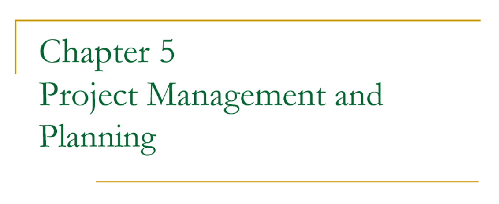

### 02
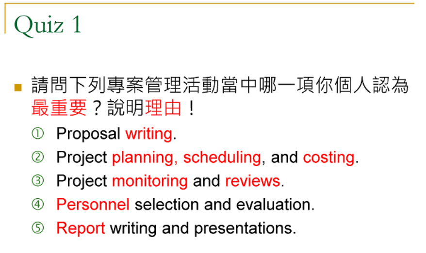

2 跟 4，最多人選

- 寫程式，都很趕，同仁、老闆都存在有強迫症的角色。
- 所以 計劃，排程。是最重要
- 人員選擇與評估最重要
- scheduling 及 costing : 成本不足會誤估功能可行性, 而導致同仁沒法即時達成任務! 
- 規畫 事先周密的規畫可能是影響成敗的重要關鍵
- 4 好的隊友帶公司上天堂，壞隊友公司上下破壞合協
- 選對人事半功倍
- 大巨蛋的專案數年前被迫停工，原因在於人(因為台北市長換人)。
- 2 管理的目的是為了完成規劃 如果不做好前置作業 時程安排與成本 就容易延遲或者完成不了
- 4
- 我覺得2最重要， 事先規畫畫好專案成功一半
- 2
- 1
- 2，規劃、排程、成本，成本正確評估非常重要
- 能夠cost down 很重要
- Proposal不對，後面全錯
- 2
- 2   一個活動的計畫、時程及成本如何沒有規劃跟理解狀況，便會執行困難或執行過程中容易遇到困難
- 4
- 專案的規劃與成本->規格釐清與成本管控, 成本太高, 很多事情都無法做
- 2
- 2. planning, scheduling and costing.scheduling需要經過客戶同意，影響到客戶繼續合作的意願cost牽涉到公司營運
- 4.人事的管理統整變數相當多
- 有好的成員，能夠提出好的提案及做好的規劃、排程
- 2 專案的進度跟流程需要夠清楚,在實作上才會事半功倍
- 同時降低成本
- 2 範疇時程成本，其中一項規劃不好可能導致專案失敗

### 03
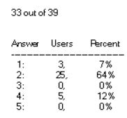

### 04
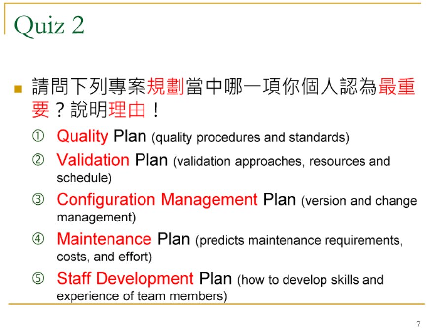

- 4
- 5，理想的話，對整個專案團隊/公司最有幫助
- 1. Quality Plan 品質的穩定度相對的代表了產品的完整度
- 5，人是公司資產
- 1對於後續驗收有很大~
- 1 品質目標
- (2) Validation Plan: 及早發現問題, 才能在模組內就修複好, 不玫引响到整個專案!
- 2. 驗證計畫，選對了人之後，驗收執行成果時就是要靠V&V來驗收究竟團隊的合作是否有如預期
- 品質，是產品存活的關鍵。
- 2 執行要正常，不然後續補資料很麻煩
- 1 專案品質決定公司的實力,對於後續維護也會有所幫助
- 品質是客戶能夠接受的標準, 並非是最佳化
- 軟體維護工作
- 2
- Iphone 賣的好：品質
- 4 最重要 要持續維護確保軟體延續性

### 05

### 06
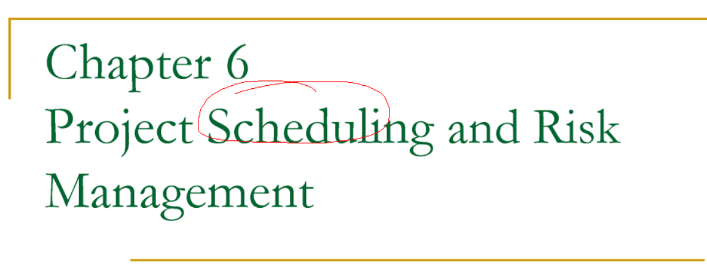

### 07

- 最快→捨棄軟體部分功能之設計
- 撤換專案經理，好的領導很重要
- 捨棄部分功能之設計，或減少部分功能之features
- 因為增加或更換人，會延伸銜接的品質問題和溝通問題
- 先減少部份功能，把核心功能先完成，之後再補上。換人，加人，加錢不見得有用。都會產品的生成，有極高的風險。
- 捨棄功能
- 增加預算
- 撤換專案經理比較快
- 捨棄部份功能
- 捨棄
- 捨棄部分功能之設計 => 將終點往前挪的概念
- 4 先捨棄部分功能,專案準時上線為準
- 減少不重要的features
- (1) 增加工程師!:  要可幫得上忙的工桯師!
- 最有效 覺得是加班 因為舊有的人力是最了解現階段的所有功能跟概念
- 在台灣的專案經理大多是有責無權，所以很難做人XD
- 增加總預算 錢可以解決的問題都是小的
- 新的人力還要重新適應
- 減少部分功能
- 增加總預算也許可以激勵員工，但就算是給予加班費或其他激勵獎金，一個人能完成的事情還是有限，但改善工作環境確實是可以打造良好的文化，長期來講是正確的，但緊急時沒有太大用處，買好的工具一樣會有學習成本的問題，或許給下一個專案有幫助，但不會是最佳解
- 教授，Scrum的做法台灣公司好像還沒跟上(印象中...)

### 08

### 09
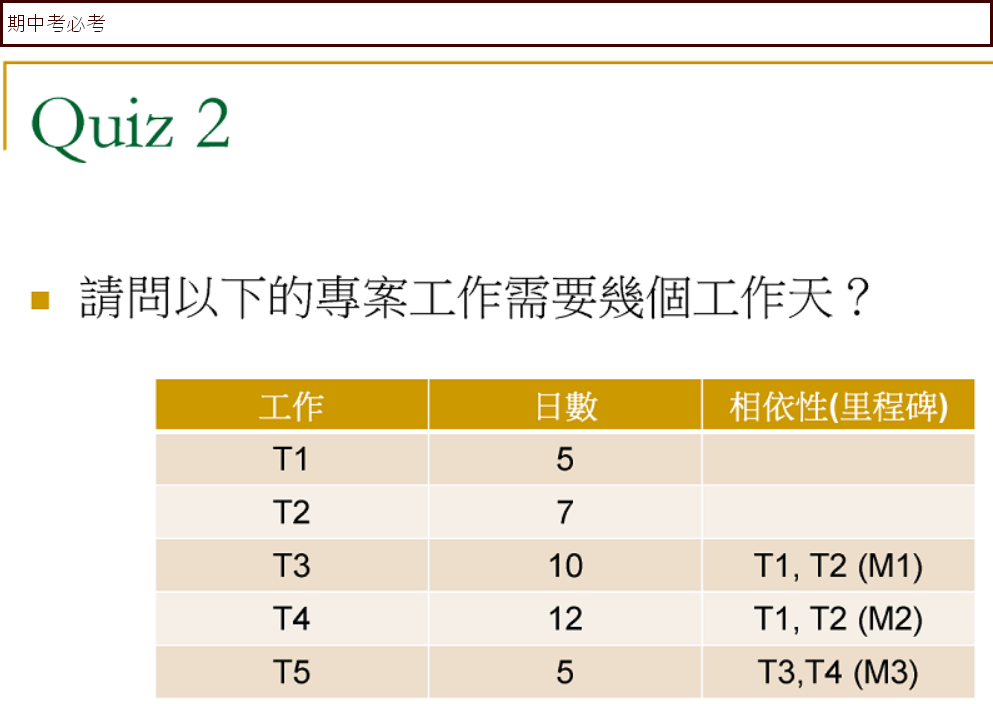

### 10
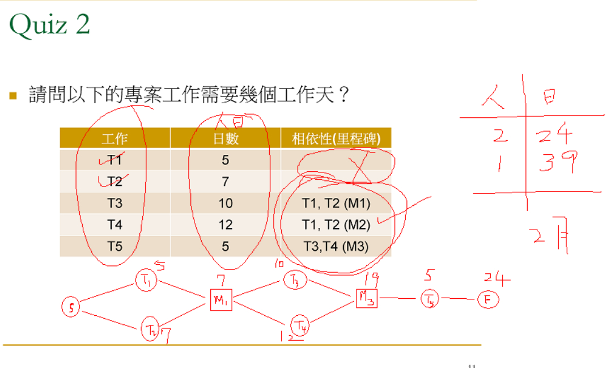

- 老師的算法如上圖

1
### 11
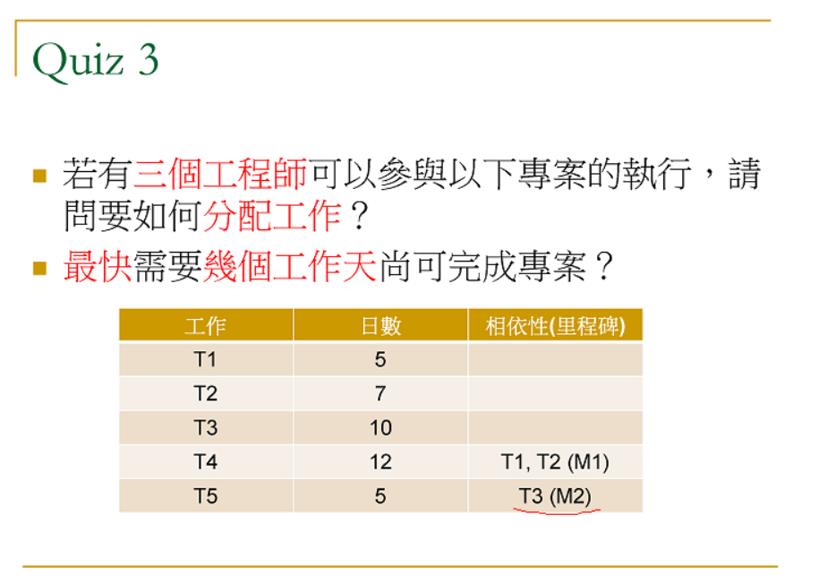

### 12
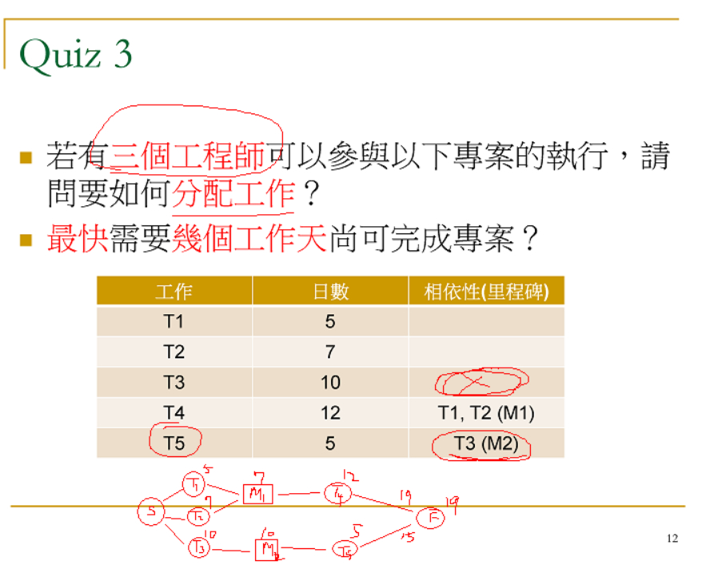

### 13
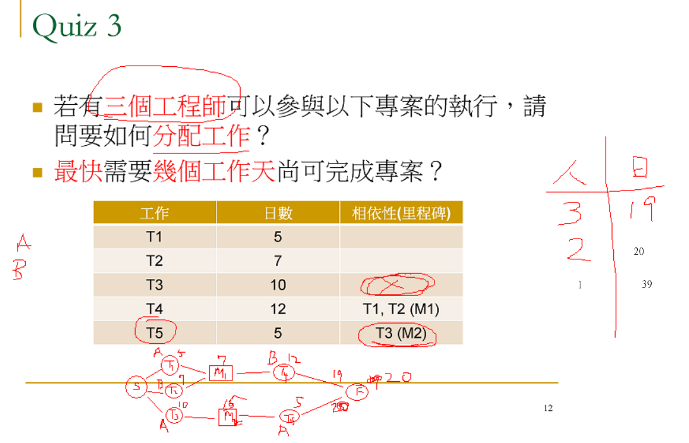

### 14
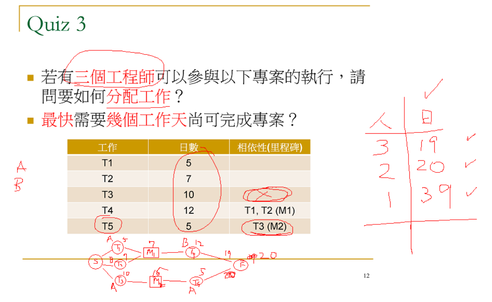

### 15
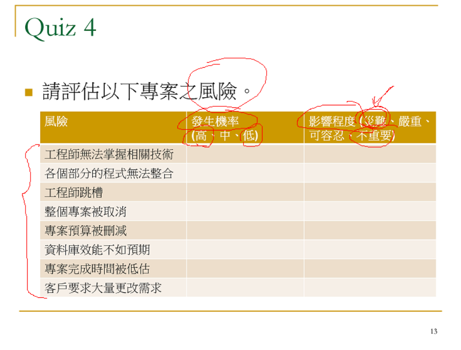

### 16
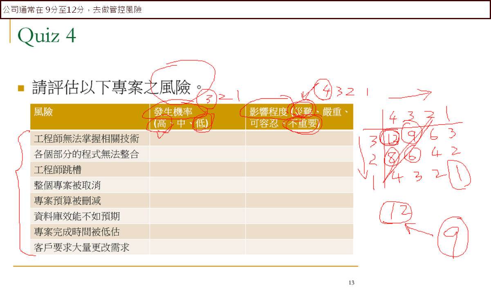

### 17
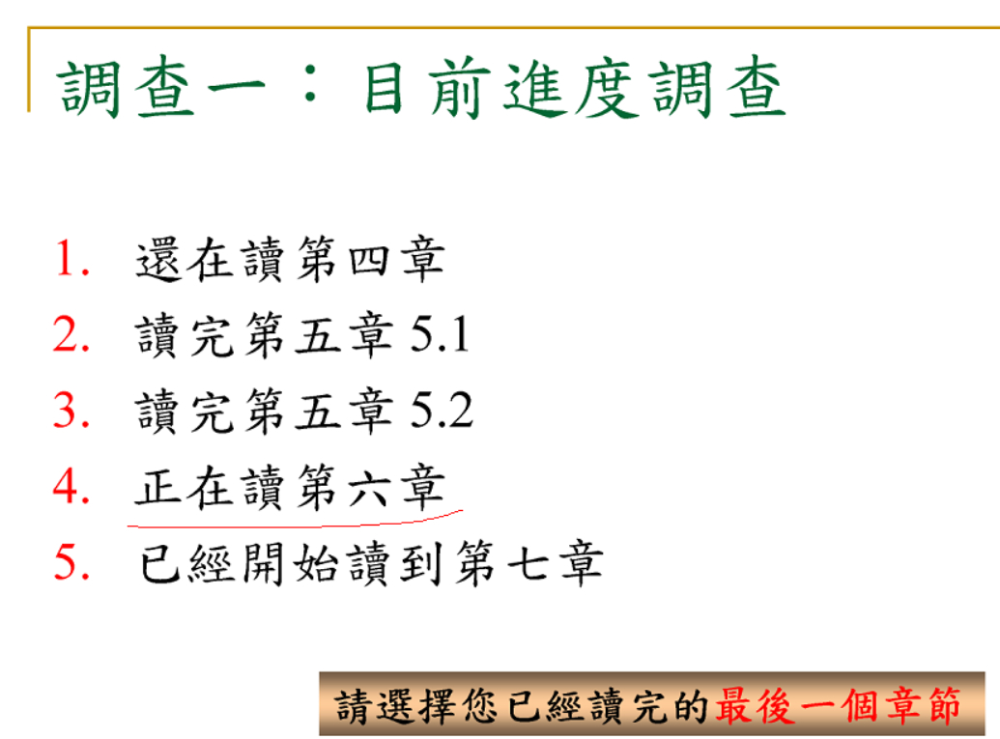

### 18
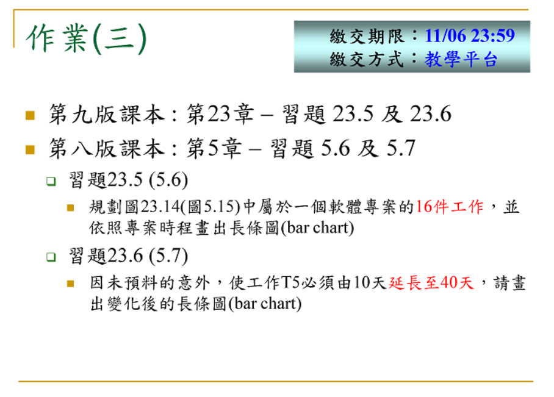

### 19

### 20
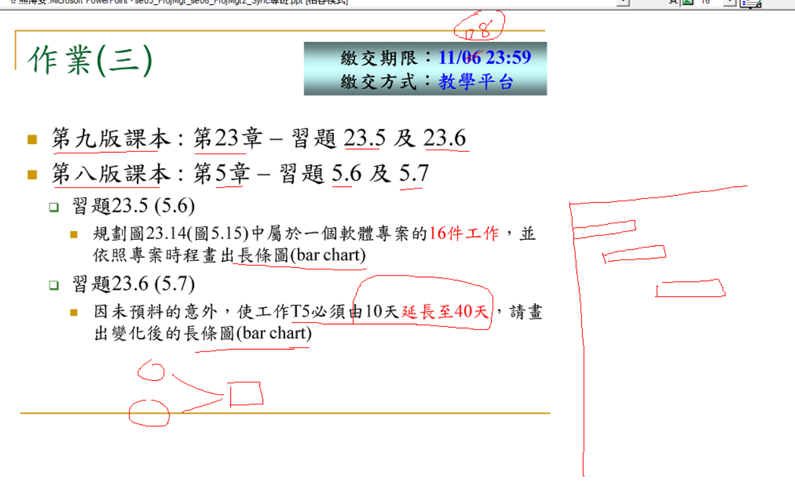

### 21
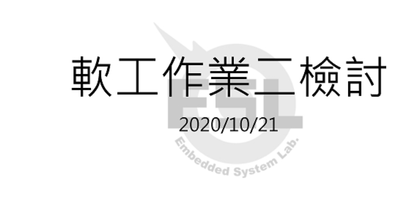

### 22
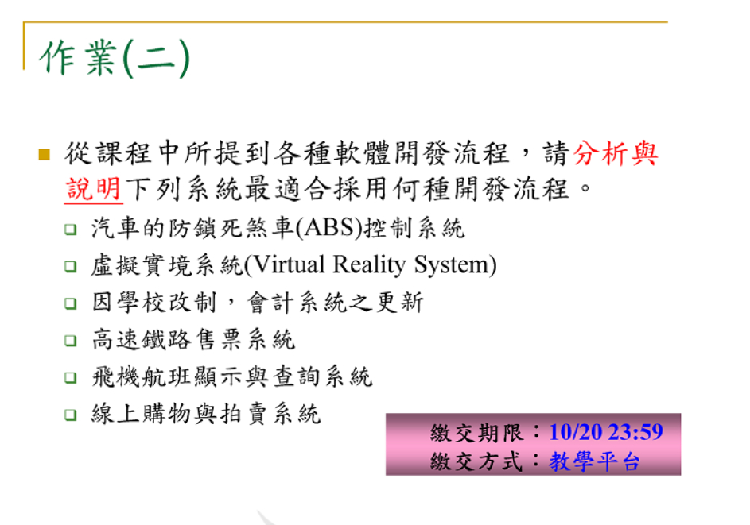

### 23
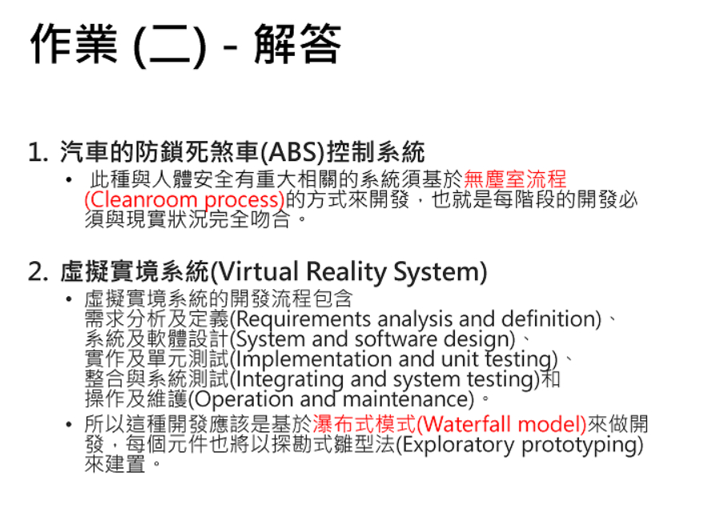

### 24

### 25

### 26

### 27
