### 01
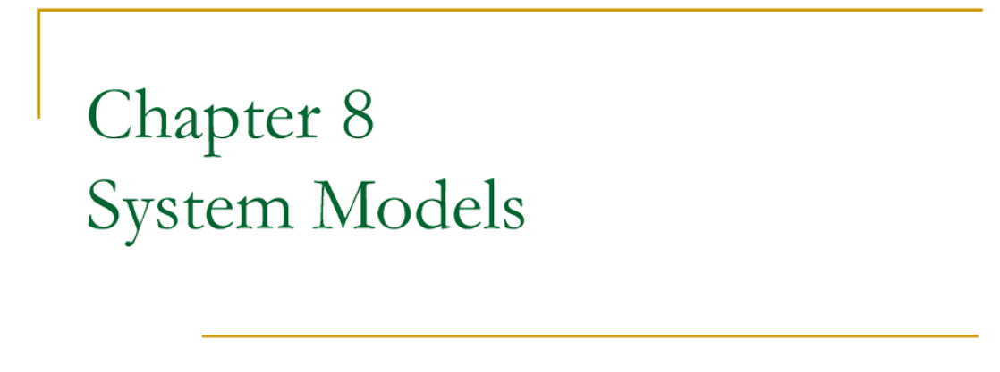

### 02

### 03

- 以架構的角度，看這個系統。
- 用不同方式來描述這個系統。
- 問題：一個冷氣機，軟體架構，有那些類別。
- 比如：壓縮機、馬達，就是一個類別，可以用軟體控制的。
- 答：溫度、壓縮機、除濕、運轉方式。風向、風力。

- `aggregation` : 

用 白色菱形

Aggregation是Association的一個特例(specialization)，用來表達兩個物件之【整體和部分(whole-part)】的關係。當B物件與A物件之間是Aggregation的關係時，代表A物件消失時，B物件還可以給C物件繼續使用。

舉例來說，機場與飛機之間的關係就是Aggregation。A機場裡面會有很多台飛機，當A機場不再存在時，裡面的飛機還可以屬於(停靠在)C機場，不會因為A機場消失了，本來停靠的飛機也跟著消失。

- `generalization` :

用 黑色菱形

除了代表兩個物件之間的whole-part關係之外，還代表這兩個物件之間是有相同的生命周期(life-cycle)。白話一點的說，若是B物件與A物件之間是composition的關係時，代表當A物件消失的時候，B物件也要跟著消失。

舉例來說，一個員工和員工薪資資料就是composition的關係，當A員工離職後，它所對應的員工薪資資料也會跟著無效。

### 04
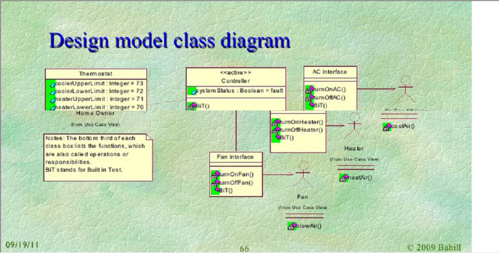

### 05
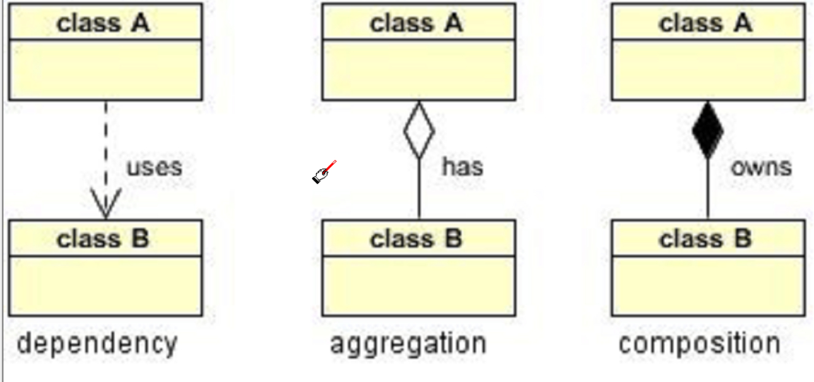

### 06
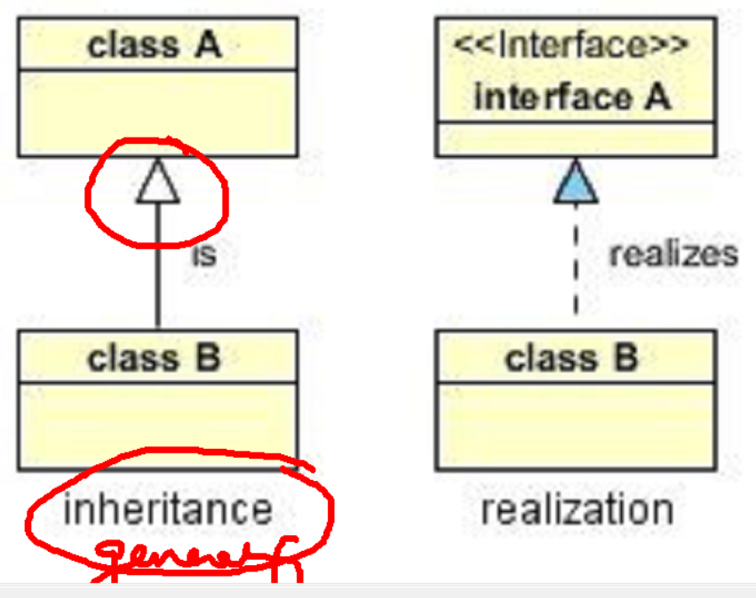

- 虛線通常是 介面

### 07
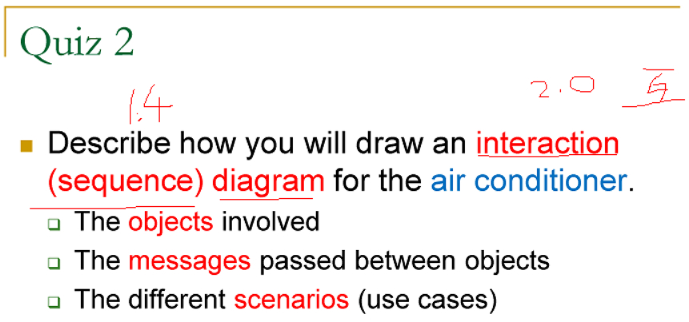

- 一開始叫 `sequence diagram` , 後面進化成 `interaction diagram`. 
- 只有 `object` 才能傳遞 訊息。
- `scenarios`(場景). 
- 問題：冷氣機，有那兩個物件傳遞訊息。
- 答：
  - 過冷或過熱
  - 遙控器 風量大小
  - 遙控器 選擇 除溼 冷氣 或軟氣
  - 更換空氣
 

### 08

互動圖範例

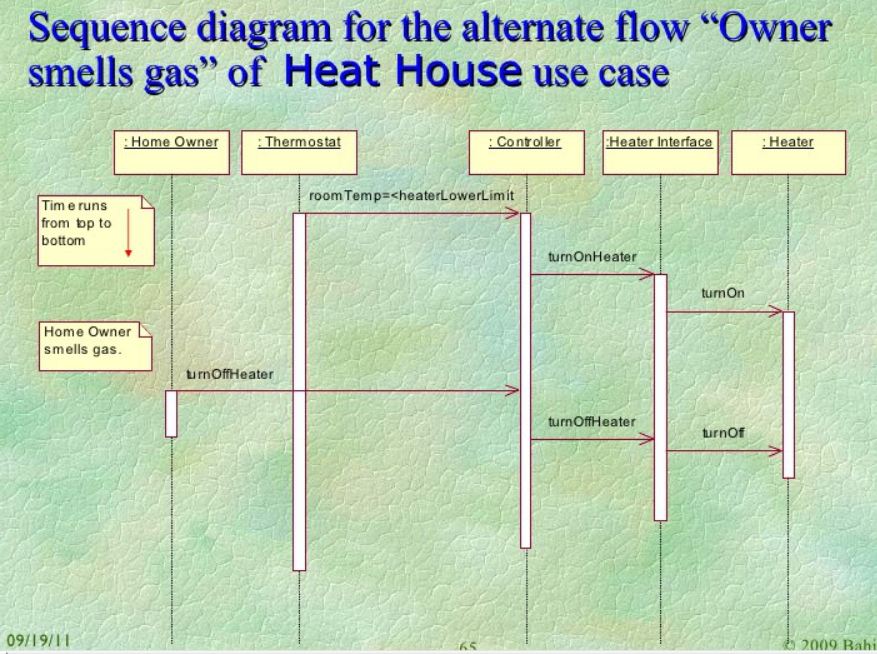

### 09

### 10
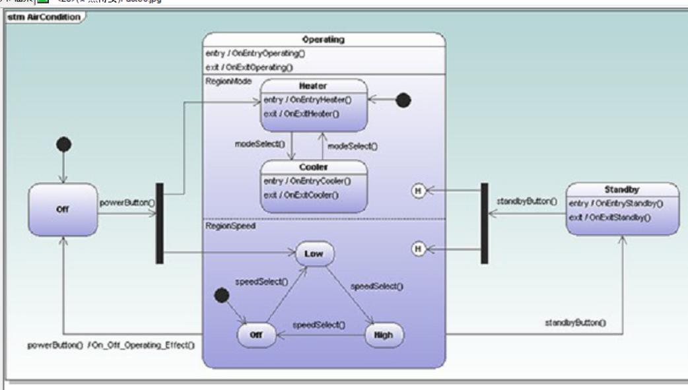
- UML 的狀態機，特色如下：
  - 階層式的特性，大包小
  - 平行運作的特性，多個元件的狀態機，一起組成
  - History, 歷史紀錄，您上次是什麼狀態，下次使用就是那個狀態

### 11

### 12

UML 最常用的模型：類別、互動、狀態機

- 期末考會考，結構、狀態(行為)、互動，搞錯，基本觀念對就行。

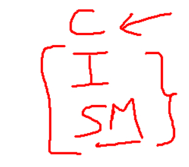

### 13

### 14
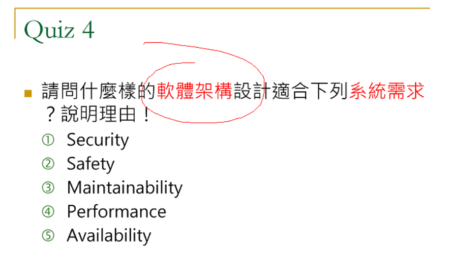

- security, 一層一層包起來

- safety , 不能讓電力斷掉，人受傷，核電廠不能爆炸
  - 怎麼確保：safety
  - 核電廠用各式各樣的冷卻系統，斷電系統。
  - 軟體方式，就把所有 safety 相關的軟體，集中測試。比如：車子，剎車系統，就完善的測試。音響系統不是 safety 的一環。

- Maintainability，怎麼的設計，才能讓我的維護方便。
  - 答：模組化，物件導向、元件導向。

- performance, 怎麼樣的設計，是 high performance
  - 答：減少程式耦合性過大，不要那麼多溝通。

- availability, 高使用度，隨時都可以用。
  - 答：容錯、備份機制、多台伺服器、負載平衡。
  - 這個跟 security , 有沖突，怎麼辦呢？必須取捨

### 15
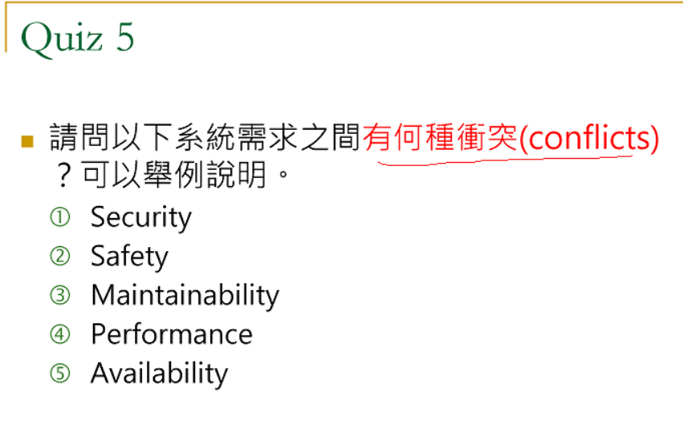

### 16
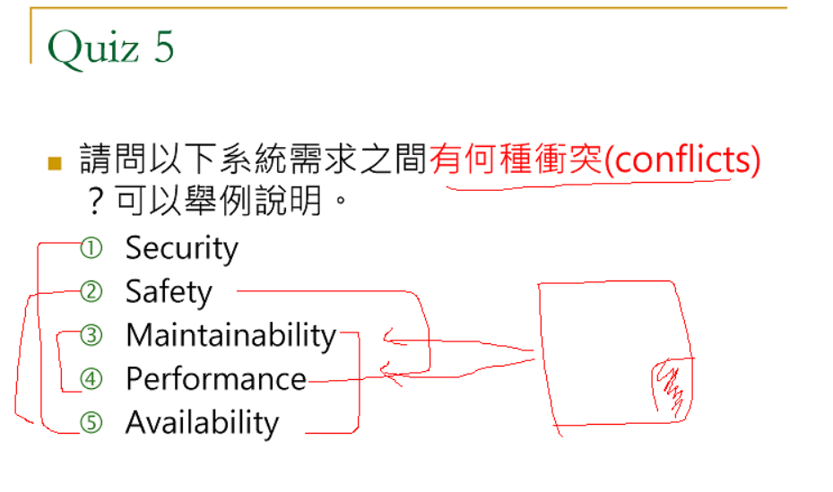

### 17

### 18
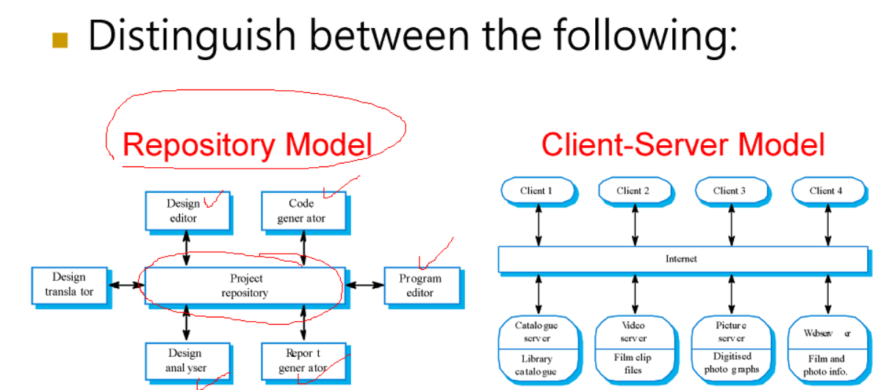

### 19
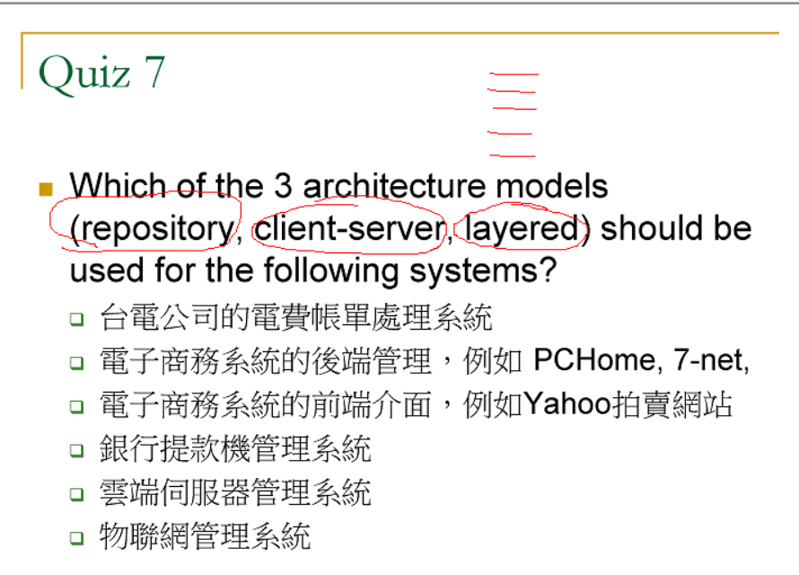

### 20

### 21

### 22
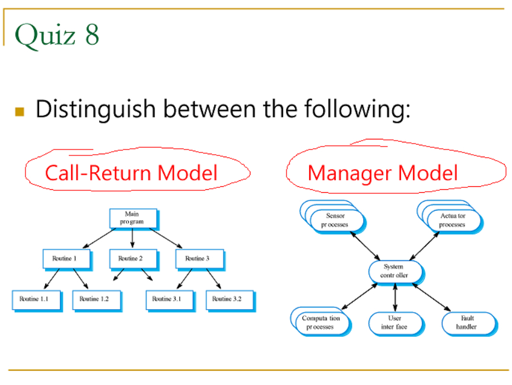

### 23
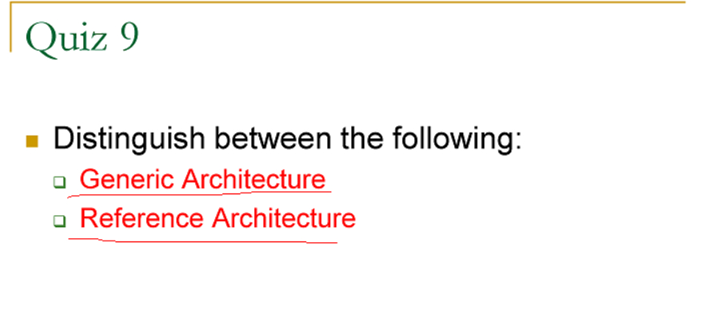

### 24

### 25
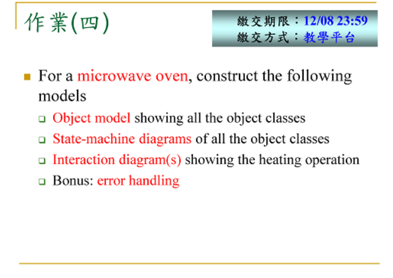

### 26

### 27

### 28
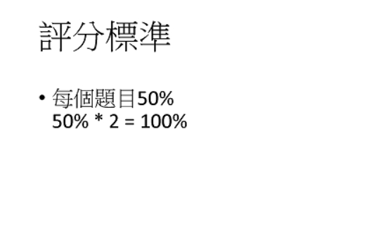

### 29
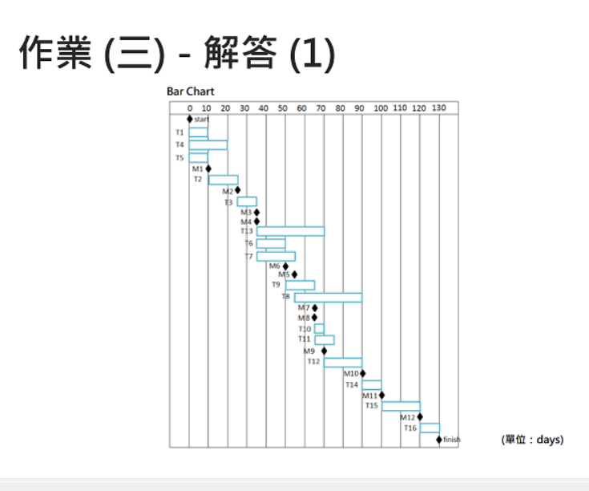

### 30
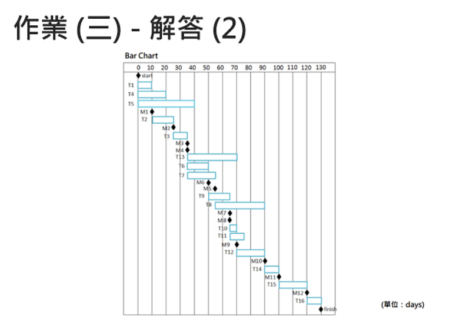

### 31

### 32

### 33

### 34

### 35

### 36

### 37

### 38

### 39

### 40

### 41

### 42

### 43

### 44

### 45

### 46

### 47

### 48

### 49

### 50

### 51

### 52

### 53

### 54

### 55

### 56

### 57

### 58

### 59

### 60

