### 01
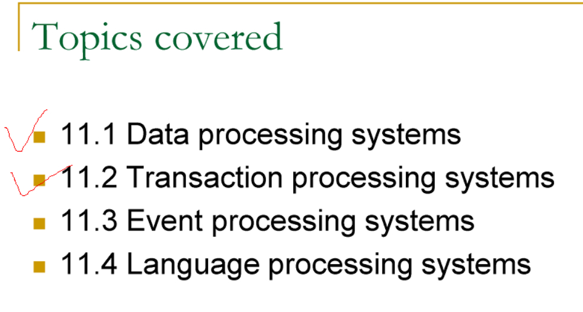

- 交易系統：必須要多種的動作，結帳有金流，結帳後，下訂單，有物流。後面還有訂購、付款，還有交貨、退貨，前後都有關聯。資料庫更新也是交易。
- 資料處理系統：比如薪水單。
- 事件處理系統：比如。紅外線防盜，紅外線被阻擋，有人入侵。遊戲里踢了角色一腳。

### 02
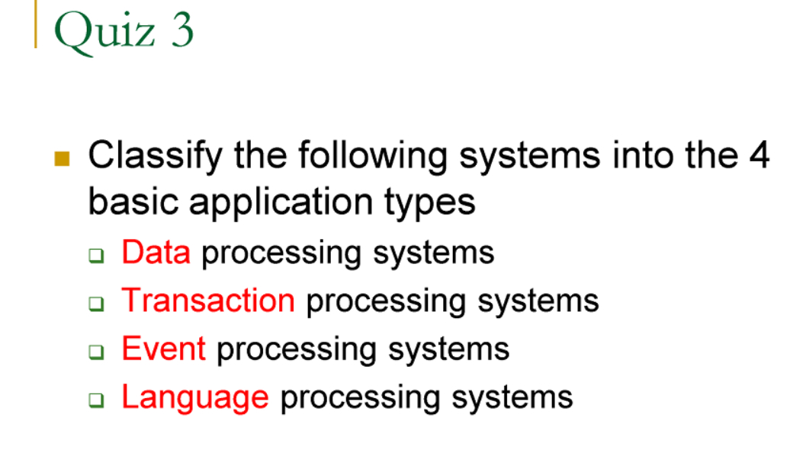

### 03

- 這是交易
### 04

- 訂閱通知扣款
- 條件滿足，就是事件，條件不符合，就是沒事

### 05
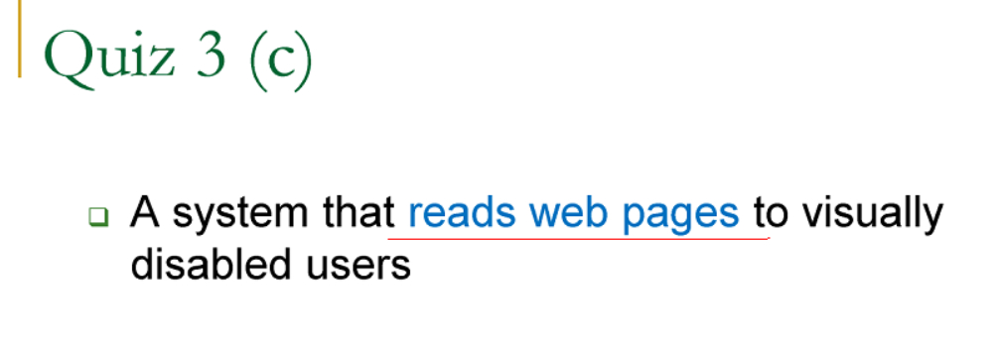

- 讀網頁內容
- 這是 語言處理

### 06
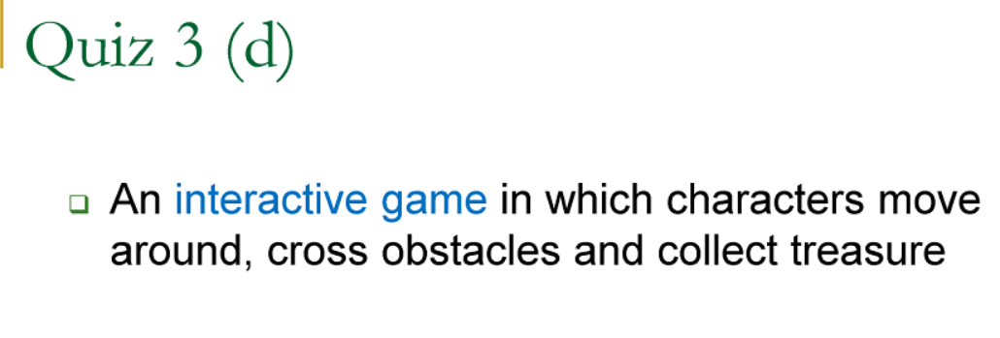

- 互動式遊戲
- 很多是事件處理，交易跟資料處理，比較少

### 07
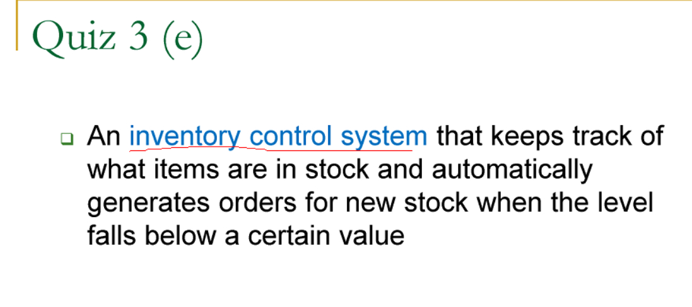

- 倉庫管理系統，發現某品項不夠時，自動下訂單。

- 資料處理，交易處理，事件處理。

### 08

- 要修改，就需要讀取跟寫入。
- 還有還原

### 09
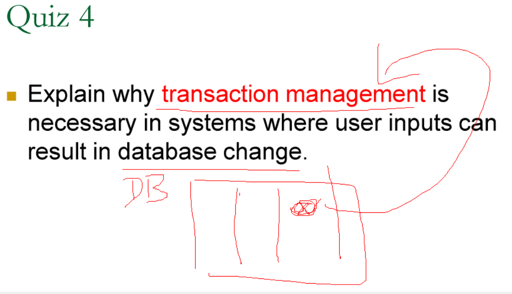

### 10

### 11
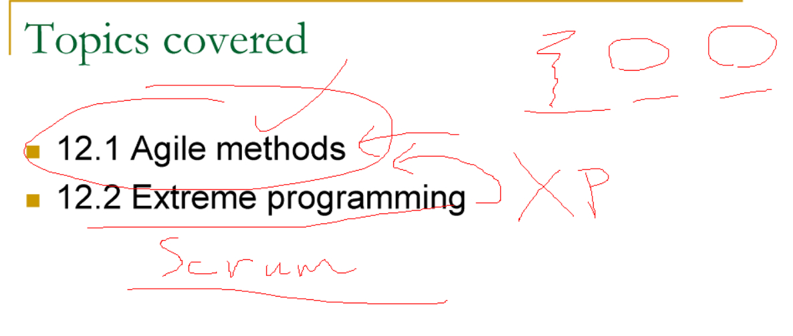

### 12
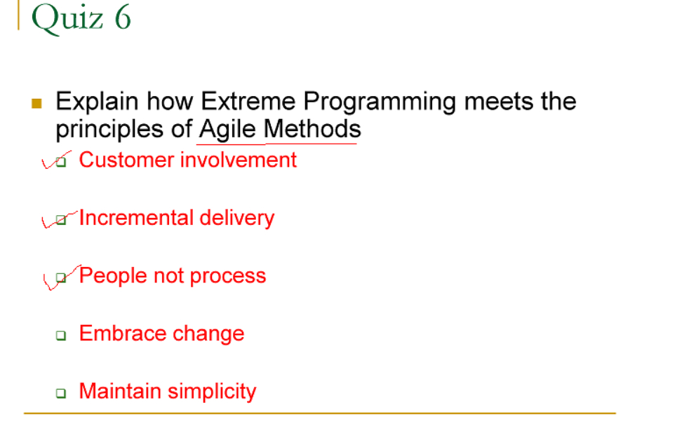

- people not process 
  - 這個講很久，兩人會程式負責 

- customer involvement
  - 客戶親自參與開發

- Incremental delivery
  - 逐步交給客戶

- Embrace Change
  - 測試先予開發，用來測試的程式，先寫出來。如果能寫出測試，那我怎麼改變，都可以。
  - Test First Development (TFT)
  - Test driven development (TDD)
  - CICD，持續整合、持續布局

- Maintain simplicity
  - Refactoring (重構)，把完整功能，分成很多小功能。避免越做越複雜。 

- refactoring ebook download，這是作業。

https://www.pdfdrive.com/refactoring-improving-the-design-of-existing-code-d185896299.html

[pdf, 下載好了](file_896_bg.pdf)

### 13
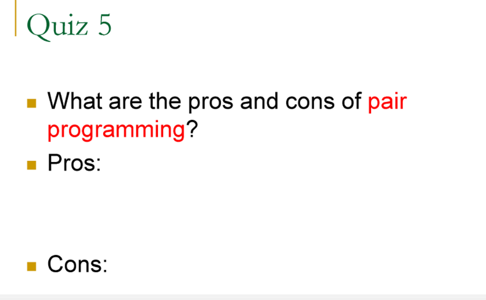

- 好處：互相監督程式。經驗分享。
- 壞處：有矛盾問題，成本增加。

### 14

- 描述五個重構的例子，要有敘述。
- TFD，好處跟壞處

### 15

### 16
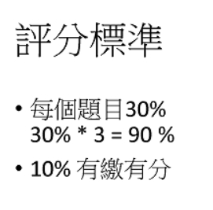

### 17
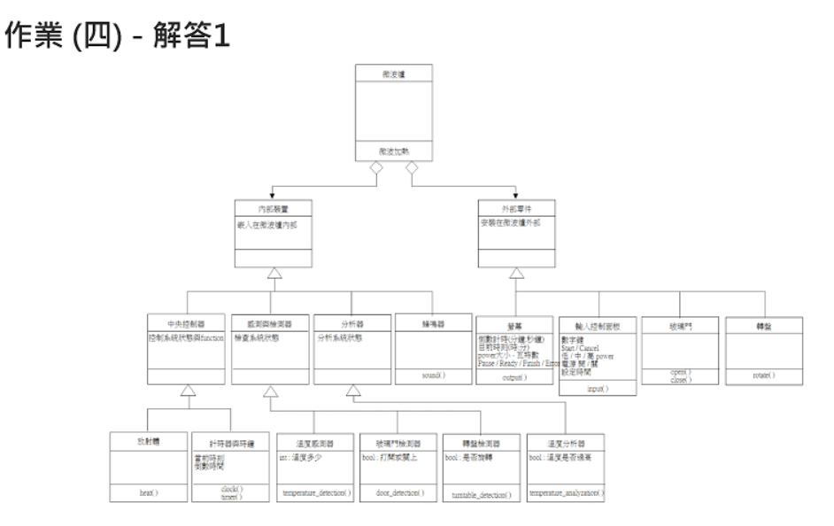

### 18
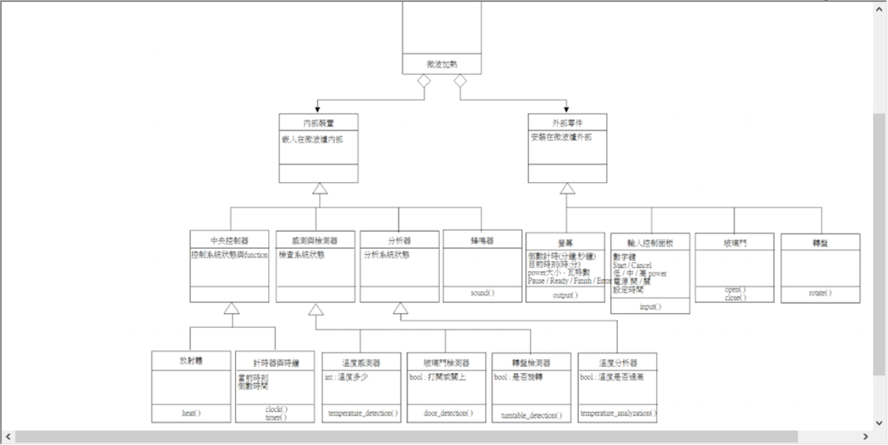

### 19

### 20
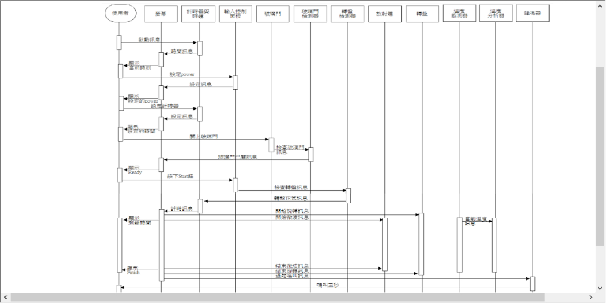

### 21
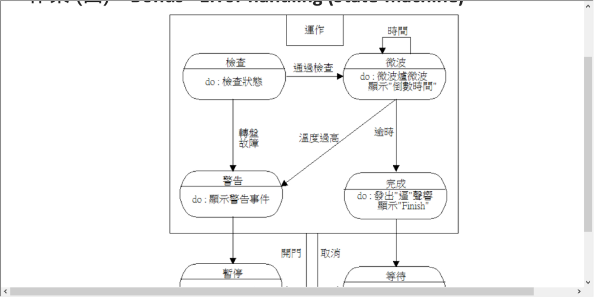

### 22

### 23

### 24
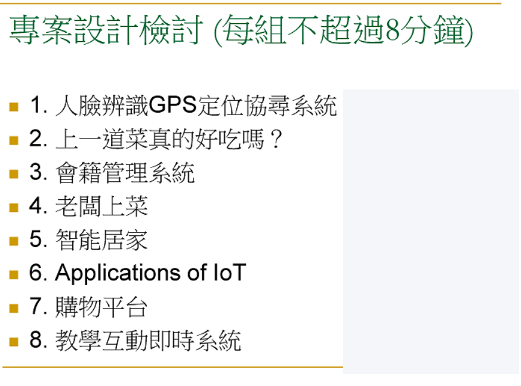

### 25
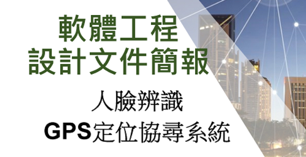

### 26

### 27

### 28

### 29

### 30

### 31

### 32

### 33

### 34

### 35

### 36

### 37

### 38

### 39

### 40

### 41

### 42

### 43

### 44

### 45

### 46

### 47

### 48

### 49

### 50

### 51

### 52

